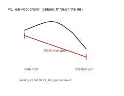
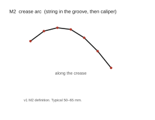
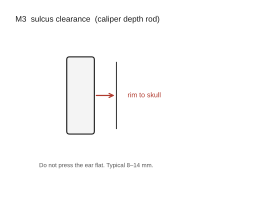
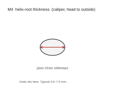
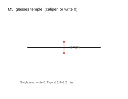
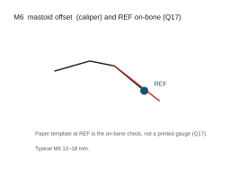
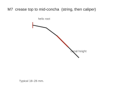
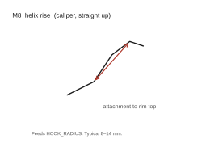

# Measure the ear (v2)

Phone sheet. Digital caliper and a non-stretch string. About ten minutes.
One step, one number. Write millimetres. Do not order anything from this
sheet.

I wrote this from `docs/fab/plan-v2.md` §8 and from the Stage B winner
in `docs/fab/packing-v2.md` §5–§6. The v1 measurement names M1 to M8
stay. The shell this sheet checks is one geometry:
`A_501015_series_w20_y8_iII_s3`.

Print `docs/fab/template.pdf` at 100 %. Do not fit to page. Measure the
50 mm bar before you trust the template. If the bar is not 50 mm, throw
the print away.

Ear: right (Q28, `docs/fab/open-questions.md`). Write `right` unless
you later tell me to flip the template.

**M1 gates everything.** If M1 is below 50.90 mm, stop. Do not measure
M2 to M8. Do not cut the template. Do not order. That gate is
`V2_M1_gate` in `packing-v2.md` §6 at bow 3 (TOTAL_CHORD 47.90 mm plus
3 mm).

Defaults if a later line is blank are the v1 reference ear
(`scripts/cad/params/default.toml`): M2 = 58, M3 = 11, M4 = 6.0,
M5 = 2.5, M6 = 15, M7 = 22, M8 = 11. A blank does not resize this
winner. It only fills the copy line.

---

## M1 — ear root length (do this first)



**Tool.** Digital caliper, outside jaws. No string.

**Landmark.** The two points where the ear joins the skull: the top of
the crease (helix root) and the bottom of the crease.

**Picture.** Stand side-on to a mirror, or take a side photo. Behind the
ear is a groove (the crease) from the top attachment down to the bottom
attachment. Open the caliper. Put one jaw on the top attachment. Put the
other jaw on the bottom attachment. The line is straight, through the
air, not along the groove.

**Typical range.** 45–58 mm.

**Gate.** The shell chord is TOTAL_CHORD 47.90 mm (`packing-v2.md` §6
`V2_TOTAL_CHORD`). The CAD script rejects the build if M1 is below
TOTAL_CHORD + 3 mm. At the winner's bow 3.0 mm the gate is 50.90 mm
(`V2_M1_gate`). Q1 reads that as M1 ≥ the gate.

The v1 formula (plan v1 §3.2–§3.3) still names how TOTAL_CHORD comes
from BODY_ARC 48.4 mm and bow `b`. This winner is frozen at bow 3. The
table is the same definition as v1, for the three reference bows:

| CREASE_BOW (mm) | 1 | 3 | 8 |
|---|---:|---:|---:|
| TOTAL_CHORD (mm) | 48.34 | 47.90 | 44.67 |
| Script gate (mm) | 51.345 | 50.901 | 47.673 |
| M1 must be at least (mm) | 51.35 | 50.91 | 47.68 |

This sheet uses the bow-3 row. Q34: nothing prints before M1.

**Write M1.** ________ mm

---

## M2 — crease arc



**Tool.** Non-stretch string, then the caliper.

**Landmark.** The same two attachment points as M1, along the crease.

**Picture.** The crease is the groove where the back of the ear meets the
skull. Lay the string in that groove from the top attachment to the
bottom attachment. Mark the two points on the string. Straighten the
string. Measure the marked length with the caliper.

**Typical range.** 50–65 mm.

**Feeds.** Recorded. This winner does not recompute CREASE_BOW from M2.

**Write M2.** ________ mm

---

## M3 — sulcus clearance



**Tool.** Digital caliper, depth rod.

**Landmark.** Mid-height of the ear. Skull in the crease, out to the helix
rim.

**Picture.** At mid-height of the ear, the rim of the ear stands off the
head. Hold the caliper behind the ear, pointing at the head. Rest the end
of the beam on the edge of the rim. Open the caliper so the depth rod
slides past the rim into the groove until it touches the head. Read the
caliper. Do not press the ear flat.

**Typical range.** 8–14 mm.

**Feeds.** Span report only. Winner BODY_THICK is 9 mm (`packing-v2.md`
§5).

**Write M3.** ________ mm

---

## M4 — helix root thickness



**Tool.** Digital caliper, outside jaws.

**Landmark.** The cartilage bridge at the top attachment, where the hook
will sit.

**Picture.** At the top of the ear, a thin cartilage ridge joins the ear
to the head; the hook sits over it. Put one jaw in the top of the groove
behind the ear, against the head. Put the other jaw on the outer face of
the ear at the same point. The jaws close sideways, head to outside, not
front to back. Close until the jaws touch. Do not squeeze.

**Typical range.** 4.5–7.5 mm.

**Feeds.** HOOK_ROOT Y (half of M4) on a later CAD run. This winner does
not wait on it.

**Write M4.** ________ mm

---

## M5 — glasses temple thickness



**Tool.** Digital caliper, outside jaws.

**Landmark.** The glasses temple where it passes the ear. If you do not
wear glasses, write 0.

**Picture.** Put the glasses on. At the ear, the temple is the arm that
runs back above the crease. Put the jaws on the temple there, top to
bottom. If there are no glasses, write 0. The hook then has no glasses
flat.

**Typical range.** 1.8–3.2 mm, or 0.

**Feeds.** GLASSES_FLAT (0.8 mm cut if M5 > 0) on a later CAD run.

**Write M5.** ________ mm

---

## M6 — mastoid offset



**Tool.** Digital caliper, outside jaws.

**Landmark.** Crease to the bony bump behind the lower ear.

**Picture.** Feel behind the lower ear for the mastoid, a hard bump of
bone. One jaw in the crease at that height. The other jaw on the peak of
the bump. The line is straight, roughly backward.

**Typical range.** 12–18 mm.

**Feeds.** Recorded. Not a CAD driver in this release.

**Write M6.** ________ mm

### On-bone check for REF (Q17)

The paper template at the reference site is the on-bone check, not a
printed gauge (Q17, `docs/fab/open-questions.md`; plan v2 §7).

Cut the outline from `template.pdf` after the 50 mm bar checks. Hold it
behind the right ear, hook at the top, printed face to the skin. The REF
mark is at (u, s) = (8.5, 43.0) mm (`packing-v2.md` §5). Write whether
that mark sits on bone.

Q28 recorded "on bone" as a preference before any fit check. This line
is the check.

**Write REF on bone.** ________ (yes / no / offset mm)

---

## M7 — crease top to mid-concha



**Tool.** Non-stretch string, then the caliper.

**Landmark.** Top attachment, along the crease, down to the height of the
ear-canal opening.

**Picture.** Look in the ear. The canal opening is the hole. Follow the
crease down from the top attachment until you are at that same height.
Mark that point. String along the crease between the top attachment and
that point. Measure the string.

**Typical range.** 18–26 mm.

**Feeds.** Recorded. Not a CAD driver in this release.

**Write M7.** ________ mm

---

## M8 — helix rise



**Tool.** Digital caliper, outside jaws, vertical.

**Landmark.** Top attachment, up to the highest point of the ear rim.

**Picture.** The highest point of the ear rim is the top of the helix,
above the attachment. One jaw on the top attachment. The other jaw on
that highest rim point. The line is straight up.

**Typical range.** 8–14 mm.

**Feeds.** HOOK_RADIUS from M8 (plan v1 §3.3, Q2). This winner's hook is
WP14's.

**Write M8.** ________ mm

---

## Write back

Give this block to me. Blank keys take the reference values above. The
winner's outline does not change.

```
SIDE    ________     (right unless you wrote left)
M1      ________ mm  (gate 50.90 mm at bow 3; packing-v2.md §6)
M2      ________ mm
M3      ________ mm
M4      ________ mm
M5      ________ mm
M6      ________ mm
REF on bone  ________  (Q17; paper template)
M7      ________ mm
M8      ________ mm
bar was 50 mm on paper  ________  (yes / no)
date    ________
```
